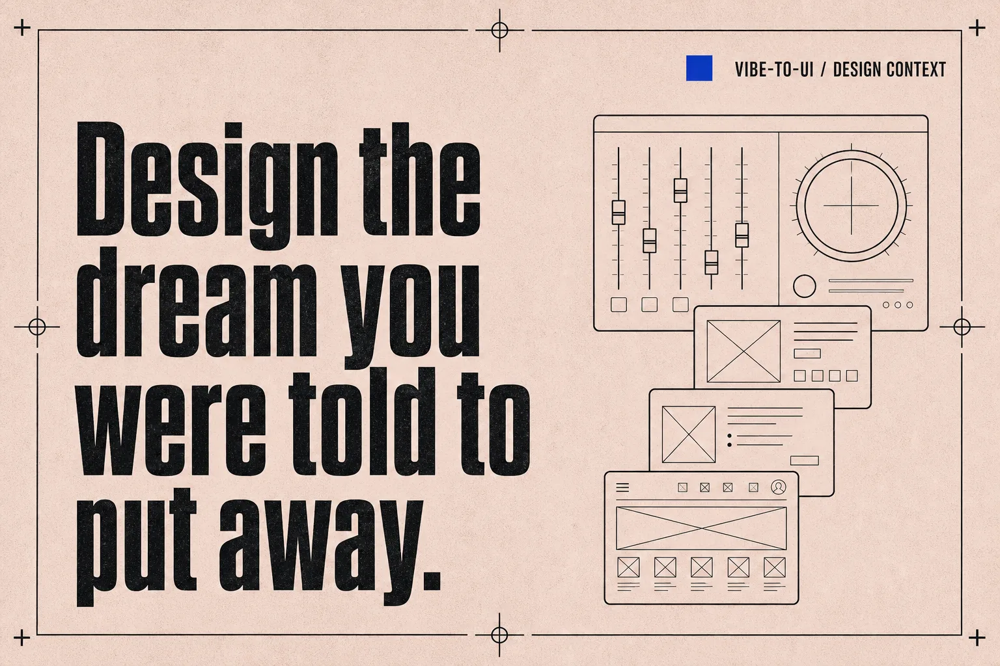

# vibe-to-ui

[中文](README.zh_CN.md)

<p align="center">
  
</p>

<p align="center">
  <strong>Design that speaks vibe — for developers who ship by feel.</strong><br />
  An <a href="https://agentskills.io">Agent Skill</a> that turns screenshots, URLs, photos, music, and gut feelings into real UI direction — then applies it only when you say so.
</p>

<p align="center">
  <a href="#install">Install</a> ·
  <a href="#what-you-can-do">What you can do</a> ·
  <a href="#how-it-feels">How it feels</a> ·
  <a href="#prompts">Prompts</a> ·
  <a href="#faq">FAQ</a>
</p>

---

## Why vibe-to-ui

Good design shouldn't need a design degree.

You can ship systems. You can feel when something looks off. What's missing is a translator — something that takes a cafe photo, a song snippet, or a site you like, and turns that *feeling* into layout, type, motion, and tokens your agent can actually use.

**Explore first. Apply when ready.** Previews and mood boards stay outside your repo until you confirm.

> Not templated taste. More beauty — in more forms, from more people.

---

## Install

```bash
npx skills add MonkeyUI-dev/vibe-to-ui#v0.3.0
```

Works with Claude Code, Cursor, Codex, Gemini CLI, Kimi Code, and any `npx`-capable agent.

<details>
<summary>Manual install</summary>

**Claude Code** → `~/.claude/skills/`

```bash
mkdir -p ~/.claude/skills
git clone https://github.com/MonkeyUI-dev/vibe-to-ui.git ~/.claude/skills/vibe-to-ui
```

**Other agents** → `~/.agents/skills/`

```bash
mkdir -p ~/.agents/skills
git clone https://github.com/MonkeyUI-dev/vibe-to-ui.git ~/.agents/skills/vibe-to-ui
```

</details>

---

## What you can do

| You want… | vibe-to-ui helps you… |
|-----------|------------------------|
| Restore a look from a URL or screenshot | Extract a full design system + motion DNA, preview first |
| Only have a feeling / references / music | Explore **3 product-aware directions** before locking tokens |
| Fix “generic SaaS layout” energy | Translate vibe → **Spatial DNA** and layout previews |
| See the direction before committing | Generate shareable **mood boards** |
| Ship it into the repo | **Apply** tokens (and assets) only after you confirm |
| Imagery that matches the direction | Generate hero / feature / empty-state visuals via your agent’s image tools |
| Reuse brand across media | Persist a local **Design Context** profile (`~/.vibe-to-ui`) |

Deep methodology lives in [`references/`](references/) — loaded on demand, not upfront.

---

## How it feels

```text
inspire → explore 3 directions → choose → preview → apply
```

1. **Bring anything** — URL, screenshot, photo, music, or a sentence of intent  
2. **Get three directions** grounded in your product (not three random themes)  
3. **Compare** concept previews + mood boards  
4. **Apply** when you say so — your project stays untouched until then  

---

## Prompts

```text
"Analyze https://example.com and give me the design tokens"

"I want something calm and modern — give me 3 visual directions for my product"

"I recorded a melody that captures the feeling — translate it into a design direction"

"Make this landing page feel editorial, not like a generic SaaS template"

"I like Concept B — apply this design to my project"

"Generate hero and feature illustrations for Concept B"

"vibe-to-ui context --profile my-brand --init"
"vibe-to-ui context --profile my-brand --target print-brochure"
```

---

## Design Context (local brand memory)

Keep a brand profile on your machine — outside the skill — so reinstall never wipes it:

```bash
node bin/vibe-to-ui.js context --list
node bin/vibe-to-ui.js context --profile my-brand --init
node bin/vibe-to-ui.js context --profile my-brand --target web
```

Root: `~/.vibe-to-ui` (fixed; no env override). Medium targets are open-ended (`web`, `linkedin`, `print-brochure`, …) — not a fixed enum.

Details: [DESIGN-CONTEXT.md](references/DESIGN-CONTEXT.md)

---

## FAQ

**Do I need to be a designer?**  
No. Bring product context and taste signals — vibe-to-ui structures the rest.

**Will it rewrite my repo immediately?**  
No. Exploration stays in standalone previews until you explicitly ask to apply.

**URL or screenshot?**  
Either. The agent adapts to what you provide.

**React / Vue / plain CSS?**  
Yes. Tokens and direction are framework-agnostic; apply respects your project conventions.

**Where do the deep guides live?**  
In [`references/`](references/) — progressive disclosure keeps startup context lean.

**Image generation?**  
Uses your agent’s **host image tool**. No API keys or MCP image providers are bundled or required. See [VISUAL-ASSET-GENERATION.md](references/VISUAL-ASSET-GENERATION.md).

---

## Media checklist

Future README visuals (flow diagram, examples, Design Context diagram, etc.) are tracked in [`docs/media/README.md`](docs/media/README.md). Only the brand slogan hero is embedded for now.

---

## License

MIT — see [LICENSE](LICENSE).

Built with ❤️ by [MonkeyUI-dev](https://github.com/MonkeyUI-dev).
