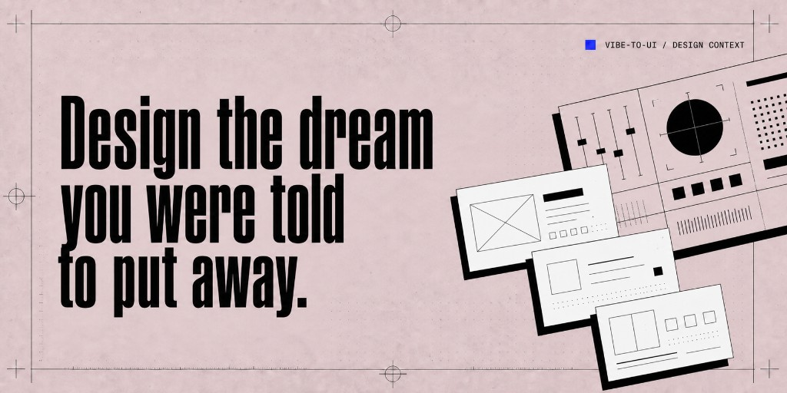

# vibe-to-ui

[English](README.md)

<p align="center">
  
</p>

<p align="center">
  <strong>让设计听懂 vibe —— 给靠感觉写代码的开发者。</strong><br />
  一套 <a href="https://agentskills.io">Agent Skill</a>：把截图、链接、照片、音乐和直觉，变成真正能用的 UI 方向；只有你确认后，才会动你的项目。
</p>

<p align="center">
  <a href="#安装">安装</a> ·
  <a href="#你能做什么">你能做什么</a> ·
  <a href="#使用节奏">使用节奏</a> ·
  <a href="#提示词">提示词</a> ·
  <a href="#常见问题">常见问题</a>
</p>

---

## 为什么做 vibe-to-ui

好设计不该要求你先拿设计学位。

你会写系统，也能感觉「哪里不对」。缺的是翻译器——把咖啡馆照片、一段旋律、或一个你喜欢的站点，翻译成布局、字体、动效和 Token，让 Agent 真正用得上。

**先探索，确认后再应用。** 预览和情绪看板默认不进仓库，直到你说「应用」。

> 不是模板化品味。更多美 —— 以更多形式，来自更多人。

---

## 安装

```bash
npx skills add MonkeyUI-dev/vibe-to-ui#v0.4.0
```

适用于 Claude Code、Cursor、Codex、Gemini CLI、Kimi Code 等支持 `npx` 的 Agent。

<details>
<summary>手动安装</summary>

**Claude Code** → `~/.claude/skills/`

```bash
mkdir -p ~/.claude/skills
git clone https://github.com/MonkeyUI-dev/vibe-to-ui.git ~/.claude/skills/vibe-to-ui
```

**其他 Agent** → `~/.agents/skills/`

```bash
mkdir -p ~/.agents/skills
git clone https://github.com/MonkeyUI-dev/vibe-to-ui.git ~/.agents/skills/vibe-to-ui
```

</details>

---

## 你能做什么

| 你想… | vibe-to-ui 帮你… |
|------|------------------|
| 从 URL / 截图还原风格 | 提取完整设计系统 + 动效 DNA，先预览 |
| 只有感觉 / 参考 / 音乐 | 先探索 **3 个贴合产品的方向**，再锁 Token |
| 摆脱「通用 SaaS 版式」 | 把氛围翻译成 **Spatial DNA** 与布局预览 |
| 锁定前先「看见」方向 | 生成可分享的 **情绪看板** |
| 真正写进项目 | 你确认后才 **Apply** Token（与素材） |
| 配图也跟方向一致 | 用宿主图像工具生成 Hero / 功能图 / 空状态等 |
| 跨媒介复用品牌 | 本地持久化 **Design Context**（`~/.vibe-to-ui`） |

更深层的方法论在 [`references/`](references/)，按需加载。

---

## 使用节奏

```text
灵感 → 探索 3 个方向 → 选择 → 预览 → 应用
```

1. **随便带什么** —— 链接、截图、照片、音乐，或一句话意图  
2. **拿到三个方向** —— 基于你的产品，而不是三个随机主题  
3. **并排比较** —— 概念预览 + 情绪看板  
4. **你说了才应用** —— 之前不改动生产代码  

---

## 提示词

```text
"分析 https://example.com 的设计，并给我设计 Token"

"我想要平静现代的感觉 —— 为我的产品给出 3 个视觉方向"

"我录了一段旋律，捕捉到了想要的感觉 —— 帮我翻译成设计方向"

"让这个落地页更像杂志，而不是通用 SaaS 模板"

"我喜欢概念 B —— 把这个设计应用到我的项目"

"为概念 B 生成 Hero 和功能配图"

"vibe-to-ui context --profile my-brand --init"
"vibe-to-ui context --profile my-brand --target print-brochure"
```

---

## Design Context（本地品牌记忆）

品牌档案存在本机，与 Skill 包分离，重装不会抹掉：

```bash
node bin/vibe-to-ui.js context --list
node bin/vibe-to-ui.js context --profile my-brand --init
node bin/vibe-to-ui.js context --profile my-brand --target web
node bin/vibe-to-ui.js context remote connect git@github.com:org/design-contexts.git
node bin/vibe-to-ui.js context sync
```

根目录：`~/.vibe-to-ui`（固定路径，无环境变量覆盖）。媒介 Target 开放自定义（`web`、`linkedin`、`print-brochure`…），不是封闭枚举。可选 Git remote sync 通过你的私有仓库跨设备/团队共享同一根目录。

详见：[DESIGN-CONTEXT.md](references/DESIGN-CONTEXT.md)

---

## 常见问题

**我不是设计师也能用吗？**  
可以。带上产品背景和品味信号即可。

**会立刻改我的仓库吗？**  
不会。探索阶段只出独立预览，直到你明确说应用。

**该给链接还是截图？**  
都可以。Agent 按你实际提供的素材适配。

**React / Vue / 纯 CSS？**  
都可以。方向与 Token 与框架无关；Apply 会尊重你的项目约定。

**更细的指南在哪？**  
[`references/`](references/) —— 渐进披露，启动时不塞满上下文。

**配图怎么生成？**  
用 Agent 的**宿主图像工具**。不内置 API Key，也不依赖 MCP 图像服务。见 [VISUAL-ASSET-GENERATION.md](references/VISUAL-ASSET-GENERATION.md)。

---

## 图片素材清单

后续 README 配图（流程图、示例、Design Context 示意图等）见 [`docs/media/README.md`](docs/media/README.md)。目前 README 仅嵌入品牌 slogan 头图。

---

## 许可证

MIT — 见 [LICENSE](LICENSE)。

由 [MonkeyUI-dev](https://github.com/MonkeyUI-dev) 用 ❤️ 构建。
