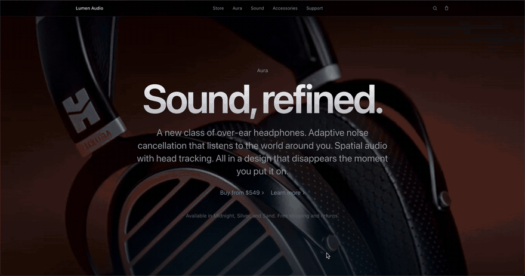
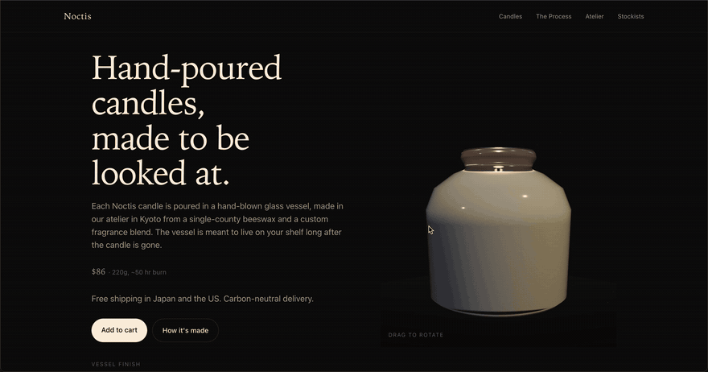
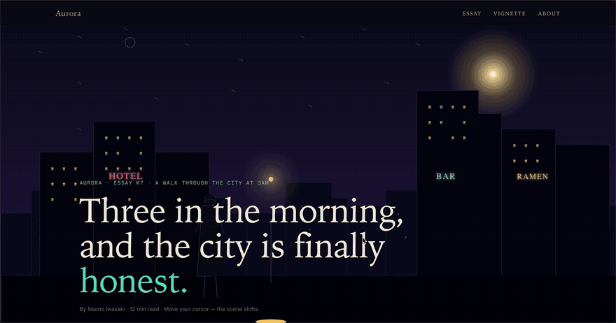
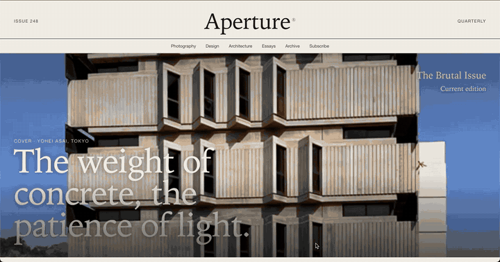
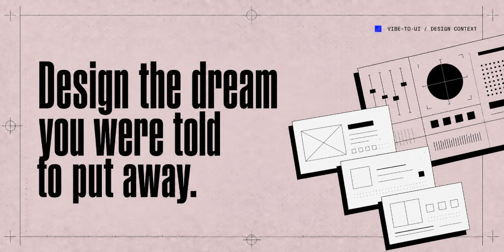

# vibe-to-ui

[English](README.md)

<p align="center">
  <strong>Make AI-generated UI actually look designed.</strong><br />
  把普通的 AI 生成页面，变成有意图的设计方向——布局、字体、动效、素材，以及让它们保持一致的规则。
</p>

<p align="center">
  <a href="#安装并立即尝试">安装并立即尝试</a> ·
  <a href="#效果示例">效果示例</a> ·
  <a href="#它如何工作">它如何工作</a> ·
  <a href="#进阶工作流">进阶工作流</a> ·
  <a href="#常见问题">常见问题</a>
</p>

<p align="center">
  <a href="https://skills.sh/MonkeyUI-dev/vibe-to-ui"></a>
</p>
---

## 看得见的变化，不只是更漂亮的提示词

同一份 AI 生成的落地页，可以显得通用，也可以有明确的设计意图。vibe-to-ui 帮你的 Agent 把参考和品味翻译成完整的 UI 方向，再决定是否进入生产代码。

带来截图、URL、图片、音乐片段，或一句模糊的感觉。你会先看见、比较并选择设计方向；确认正确后，再应用到项目。

## 安装并立即尝试

```bash
npx skills add MonkeyUI-dev/vibe-to-ui#v0.6.0
```

然后把这句话交给你的 Agent：

```text
这个落地页看起来像通用的 AI UI。请使用 vibe-to-ui 内置的视觉参考启动素材，先识别它的页面类型，
再给我 3 个真正有设计感的视觉方向。为每个方向生成预览，并使用可用的图像生成工具创作一组与其
设计系统一致的原创视觉参考素材（按需要提供 Hero 图、插画或纹理）。在我选择之前，不要修改项目。
```

适用于 Claude Code、Cursor、Codex、Gemini CLI、Kimi Code，以及所有支持 `npx` 的 Agent。

<details>
<summary>手动安装</summary>

**Claude Code** → `~/.claude/skills/`

```bash
mkdir -p ~/.claude/skills
git clone https://github.com/MonkeyUI-dev/vibe-to-ui.git ~/.claude/skills/vibe-to-ui
```

**其他 Agent** → `~/.agents/skills/`

```bash
mkdir -p ~/.agents/skills
git clone https://github.com/MonkeyUI-dev/vibe-to-ui.git ~/.agents/skills/vibe-to-ui
```

</details>

## 效果示例

### Lumen Audio

<p align="center">
  
</p>

**用到的能力：**设计探索 · 字体探索 · 动效系统

### Noctis Candles

<p align="center">
  
</p>

**用到的能力：**页面类型识别 · 设计探索 · 动效系统

### Aurora

<p align="center">
  
</p>

**用到的能力：**空间氛围 · 字体探索 · 动效系统

### Aperture

<p align="center">
  
</p>

**用到的能力：**页面类型识别 · 空间氛围 · 字体探索

---

## 它如何工作

```text
参考或意图 → 3 个方向 → 预览 → 你选择 → 应用
```

1. **带来一个信号** —— URL、截图、图片、音乐片段，或一句描述。
2. **看见三个方向** —— 每个方向都基于产品与页面类型，而不是随机换主题。
3. **提交前先比较** —— 独立的概念预览和情绪看板，让选择变得具体。
4. **准备好才应用** —— 直到你明确确认前，探索结果都停留在项目之外。

你的 Agent 不必再猜测「做得高级一点」究竟是换色、换布局，还是使用更克制的动效。vibe-to-ui 会把这类判断变成双方都能审阅的设计方向。

---

## 进阶工作流

<details>
<summary><strong>还原或分析已有 UI</strong></summary>

用 URL 或截图提取设计系统、动效 DNA 和可审阅的预览，再决定是否应用。

```text
分析 https://example.com，并给我它的设计 Token 和动效系统。
```

完整方法见 [Design System](references/DESIGN-SYSTEM.md)、[Motion System](references/MOTION-SYSTEM.md) 与 [Spatial Vibe](references/SPATIAL-VIBE.md)。

</details>

<details>
<summary><strong>保留本地 Design Context</strong></summary>

把品牌档案存放在 Skill 包之外，因此重装 Skill 也不会重置你的视觉语言。

```bash
node bin/vibe-to-ui.js context --profile my-brand --init
node bin/vibe-to-ui.js context --profile my-brand --target web
node bin/vibe-to-ui.js context --profile my-brand --target print-brochure
```

Profile 存在 `~/.vibe-to-ui` 下；媒介 target 可以自由定义。可选的 Git 同步能通过你的私有仓库，在设备之间共享 Profile 与 Inspiration。

[阅读 Design Context 指南 →](references/DESIGN-CONTEXT.md)

</details>

<details>
<summary><strong>建立 Inspiration Library</strong></summary>

把真实产品页面和截图收进全局资料库，将整页视觉分析与品牌规则分开保存；只在你决定时，才链接或应用产品级的设计 seed。

```bash
node bin/vibe-to-ui.js inspiration add https://example.com --product example --page home
node bin/vibe-to-ui.js inspiration link example --profile my-brand
node bin/vibe-to-ui.js inspiration apply example --project . --confirm
```

[阅读 Inspiration Library 指南 →](references/INSPIRATION-LIBRARY.md)

</details>

---

## 常见问题

**我不是设计师，也能用吗？**<br />
可以。带来产品背景和品味信号，vibe-to-ui 会和你一起整理视觉决策。

**它会立刻重写我的项目吗？**<br />
不会。探索阶段只生成独立预览；只有你明确要求应用已确认的方向，项目才会被修改。

**我可以只给截图，不给 URL 吗？**<br />
可以。截图、URL、照片、音乐片段或文字意图，都可以是有用的起点。

**React、Vue 或纯 CSS 可以用吗？**<br />
可以。方向和 Token 与框架无关；实际应用时会遵守项目已有的约定。

**是否内置图像生成 API，或要求 API Key？**<br />
不需要。默认使用 Agent 宿主提供的图像工具；当 MiniMax 可用且适合该素材时，你可以显式选择它，凭据始终留在项目之外。见 [Visual Asset Generation](references/VISUAL-ASSET-GENERATION.md)。

---

<p align="center">
  
</p>

<p align="center">
  <em>Design the dream you were told to put away.</em>
</p>

## 许可证

MIT —— 见 [LICENSE](LICENSE)。

由 [MonkeyUI-dev](https://github.com/MonkeyUI-dev) 用 ❤️ 构建。
